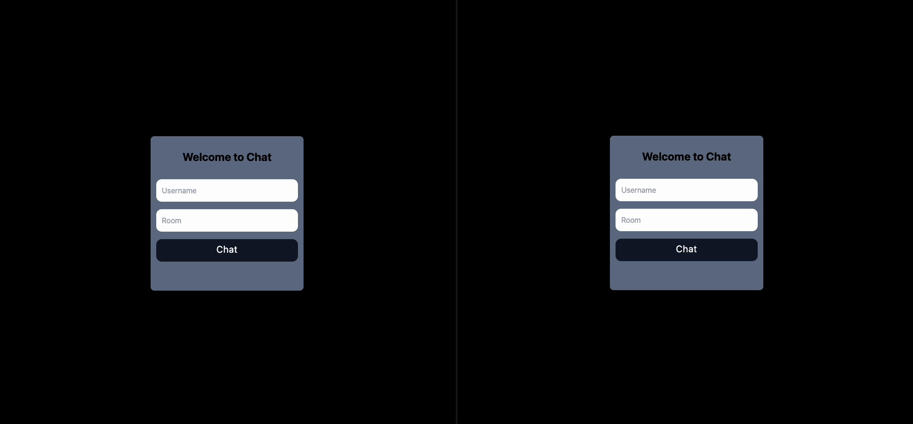

# socketChat

This is a simple real-time chat application built with Socket.io. The app allows users to connect to chat rooms by choosing a username. Once connected, two users can join the same room and start chatting with each other.

## Features

- Users can enter a username to join a chat room.
- Real-time communication between two users in the same room.
- Simple and intuitive interface.

## Tech Stack

- Express
- Nodemon
- Cors
- Socket.IO
- TailWind CSS

